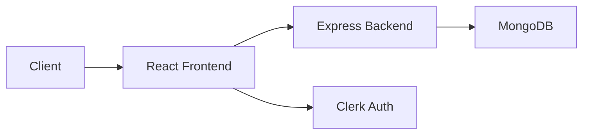
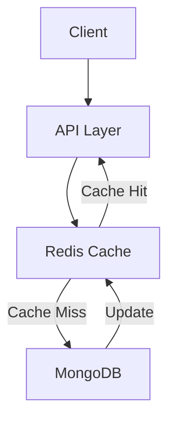

# TableCheck SWE Fullstack Take-Home Assignment

Remote Waitlist Manager is a full-stack application designed to handle the waitlist of your restaurant. It manages seating, queueing, and notifications for your diners. **Multiple parties** should be able to join your restaurant's waitlist **concurrently**. Instead of waiting in line to write your name on a piece of paper, you can now join the waitlist virtually and get notified when your table is ready. This will increase your restaurant's efficiency and provide a better experience for your customers.

The user flow is as follows:

- A party of diners go to their favorite restaurant. It's fully booked, but the restaurant gives the option to join a virtual waitlist accessible via browser.
- When the diner opens the app they're asked to input their name and party size.
- After joining the waitlist, they can check the app to verify if it's their turn.
- When the table is ready for them, they check-in via the app and get seated.

## Technical Requirements

### Frontend

Our current tech stack uses ReactJS, TypeScript and isomorphic SSR, but you shouldn’t be limited to that. If you feel more proficient with a different stack, just go for it! Feel free to use a SPA, islands, traditional SSR, vue, angular, ember, vanilla JS, etc.

### Backend

Similarly, while our stack uses Ruby on Rails with MongoDB, you’re free to use any mainstream language/framework and storage.

Whatever database you decide to use, it should be runnable with a simple `docker compose up`.

## Business Requirements

**Restaurant Capacity**

Hardcoded to 10 seats.

**Service Time Calculation**

Hardcoded to 3 seconds per person. Example: A party of 4 takes 12 seconds to complete the service.

**Joining the waitlist**

The diner opens the app that shows a single form with these form elements:

1. Name input (text)
2. Party size input (number)
3. Submit button. When clicked, the party is added to the waitlist queue.

**Checking in and starting the service**

When the queued party is ready to begin service, the app should display a "check in" button. When clicked:

- The party is removed from the waitlist queue.
- The number of seats available should be decreased by the party size.
- The service countdown starts for that party.

Importantly, the user _must_ be able to view the state of their queued party across multiple browser sessions.

**Queue management**

When a party completes service:

- The system checks the queue for the next party.
- If the seats available are enough for the next party size, the next party’s app shows a new “Check-in” button.
- If not, wait until enough seats are available.

## Submission Guidelines

1. Create a public GitHub repository for your project.
2. Include this README in your repository, with clear instructions for setting up and running the project locally.
3. Include a brief explanation of your architecture decisions in the README or a separate document.

Please grant access to your repo for these following github users

- `lerio` - Valerio Donati, VPoE at TableCheck
- `daniellizik` - Daniel Lizik, Engineering Manager at TableCheck
- `akashgupta-tc` - Akash Gupta, Associate Engineering Manager at TableCheck

## Evaluation Criteria

Your submission will be evaluated based on:

1. Functionality: Does the application work as specified?
2. Code Quality: Is the code well-structured, readable, and maintainable? Add sufficient comments in places where you think it would help other contributors to onboard more quickly to understand your code.
3. Architecture: Are there clear separations of concerns and good design patterns used?
4. Customer Focus: Is the user experience intuitive? Would _you_ use this application if you were a diner? _Please_ play around with your app as if you were a customer prior to submission.
5. QA: Are you confident in the quality of your product? If you had to refactor or add new features, would you be able to do so without breaking the existing functionality? There is no guideline on how many tests you should write, what type of tests you should write, what level of coverage you need to achieve, etc. We leave it to you to decide how to ensure a level of quality that results in your customers trusting your product.

### Good luck!

## Submission

# 🍽️ Restaurant Waitlist Manager

A modern, real-time restaurant waitlist management system built with React and Node.js. Efficiently manage restaurant seating with table assignments and real-time status updates.

## 📝 Note on Environment Variables
The `.env` file is included in the repository for local testing purposes as it contains the Clerk publishable key which is a managed autentication solution that I have implemented.

## 🚀 Getting Started

### Prerequisites

- Node.js 18+
- MongoDB
- Docker and Docker Compose

### Installation

1. Clone the repository
```bash
git clone https://github.com/Kartik1745/TableCheck-Assignment.git
cd TableCheck-Assignment
```

2. Install dependencies
```bash
npm install
```

3. Start MongoDB using Docker
```bash
docker compose up
```

4. Start the development server
```bash
# Start backend server
npm run server:dev

# Start frontend development server
npm run dev
```

## 🎭 Fun Testing Feature (Not a Bug, I Promise!)

You might notice something - the Join Waitlist form doesn't disappear after you join. But wait! Before you file that bug report, let me explain:

In all seriousness, this is intentionally left this way to:
- Test multiple party scenarios
- Simulate busy restaurant conditions

Note: In a production environment, I can conditionally render the form based on whether the user already has a party in the waitlist. 🎉

### 🎯 Restaurant Dashboard View

The app includes a special restaurant dashboard view that shows the complete picture of all active parties in the queue - not just user-specific ones. This view is perfect for:

- 🔍 Testing the app's real-time capabilities
- 👥 Seeing how multiple parties interact in the queue
- ⚡ Experiencing the dynamic nature of the waitlist system
- 🕒 Observing the automated table management in action

## ✨ Features

- **Real-time Waitlist Management**
  - Live queue updates
  - Dynamic wait time calculations

- **Smart Table Management**
  - Automatic seat availability tracking
  - Optimized table assignments
  - Service time monitoring

- **User Authentication**
  - Secure sign-in with Clerk
  - Role-based access control
  - User-specific waitlist views

- **Responsive Design**
  - Clean, modern UI
  - Intuitive user experience

## 🛠️ Tech Stack

- **Frontend**
  - React 18 with TypeScript
  - Tailwind CSS for styling
  - React Query for state management
  - Clerk for authentication
  - Lucide React for icons

- **Backend**
  - Node.js with Express
  - MongoDB for data persistence
  - Mongoose ODM
  - Docker for containerization

## 🏗️ Architecture and Flow


### Architecture Decisions

1. **Frontend Architecture**
   - **Component-Based Structure**: Organized into small, reusable components for better maintainability
   - **Custom Hooks Pattern**: Separated business logic into custom hooks (e.g., `useWaitlist`)
   - **Service Layer**: Isolated API calls in service files for better separation of concerns
   - **Type Safety**: Comprehensive TypeScript types for better development experience

2. **Backend Architecture**
   - **Service Layer**: Business logic isolated in service files
   - **Repository Pattern**: Database operations abstracted in repository layer

3. **State Management**
   - **React Query**: Chosen for efficient server state management and caching
   - **Local State**: Component-level state for UI-specific data

### Data Flow

1. **Client Interaction**
   - User joins waitlist
   - Real-time updates via polling
   - Table status monitoring

2. **Server Processing**
   - Waitlist queue management
   - Table availability tracking
   - Service time calculations

3. **Data Persistence**
   - Party information storage
   - State management

## 🧩 Key Components

### Frontend Components

- **JoinWaitlist**
  - Handles new party registration
  - Validates party size and details
  - Provides immediate feedback

- **PartyList**
  - Displays active and waiting parties
  - Real-time status updates
  - Check-in functionality

### Backend Services

- **WaitlistService**
  - Queue management
  - Party status updates

- **ActiveTablesService**
  - Table availability tracking
  - Check-in management

## 🔮 Future Scope

### Redis Integration for Scale

To handle millions of transactions, I plan to implement Redis as a caching layer between our application and database:



3. **Scaling Benefits**
   - Reduced database load (80-90% read operations from cache)
   - Sub-millisecond response times
   - Horizontal scaling capability
   - Better handling of traffic spikes